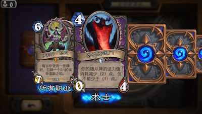
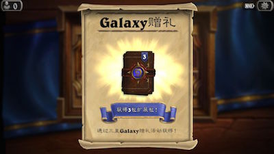
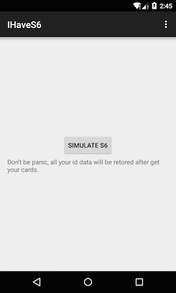

#IHaveS6

Mock your device to a galaxy s6 to get the s6 promotion gifts from Hearthstone.

Here is what i get:

#UI

#What it does

The app will change the system properties and restart. Then when you launch Hearthstone app again, it will recognize your device as Galaxy s6.
After you get the promotions, you can restore your configuration in the app again.

Because the system properties is read only, you have to root your device first.

#Warnning

**I only success run it in genymotion and it will make my nexus 5 stuck in boot loop.**

But i still can't figure out why. Try on your own risk.
